# Clustering Soccer Players

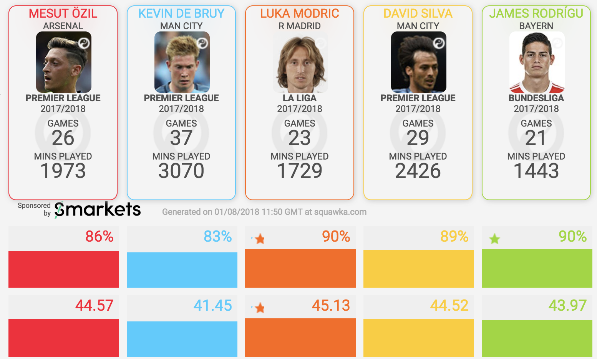

## Motivation:

One of my biggest passions in life lies within the sport of soccer. I love everything about the game, from watching casually, to analyzing tactics, analyzing soccer data has always been something I was interested in. When watching soccer, I always find myself saying "I wish we had a player like player X", this project helps to address that statement. This project aims to use data on soccer player attributes in order to draw better comparisons between players.

## Project Description:

For this project, I explored soccer player attributes from the EA Sports video game FIFA in an attempt to cluster players based on playstyle. This project addresses two main questions:
  - Can players be clustered based on their playstyle?
  - What players are most similar to player X that have the same playstyle?

Based on prior knowledge, soccer players can generally be identified by the following playstyles:

  - Winger, False 9, Target Forward, Striker
  - Deep Lying Playmaker, Advanced Playmaker, Holding Midfielder, Box to Box Midfielder
  - Centerback, Fullback, Wingback

This project aims to cluster players according to similar playstyles, and use these clusters as means of player comparison. For players in the same cluster, K nearest neighbors can determine the most similar players to that player based on playstyle.

## Data:

Data for this project comes from a dataset on kaggle which can be found [here](https://www.kaggle.com/hugomathien/soccer/kernels). This data comes in the form of a SQL database with 7 different tables. The main table used in this project was the Player_Attributes table which contained the FIFA attribute ratings for each player.

This dataset contained FIFA ratings from FIFA 12-16 and each player had multiple rows with their attributes over this time period. The data contained the following features:

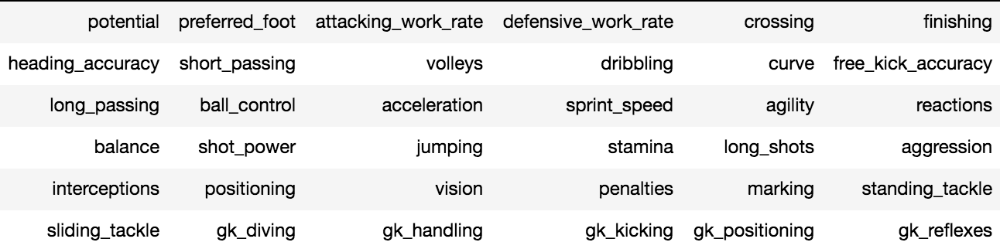

## Data Cleaning:

The following actions were performed to clean the data:
  - Remove players with NaN's
  - Aggregate player attributes over time to the mean values
  - Remove statistics not representative of playstyle (preferred foot, work rates, etc)
  - Standardize data

## EDA:
Examining the distribution of features:

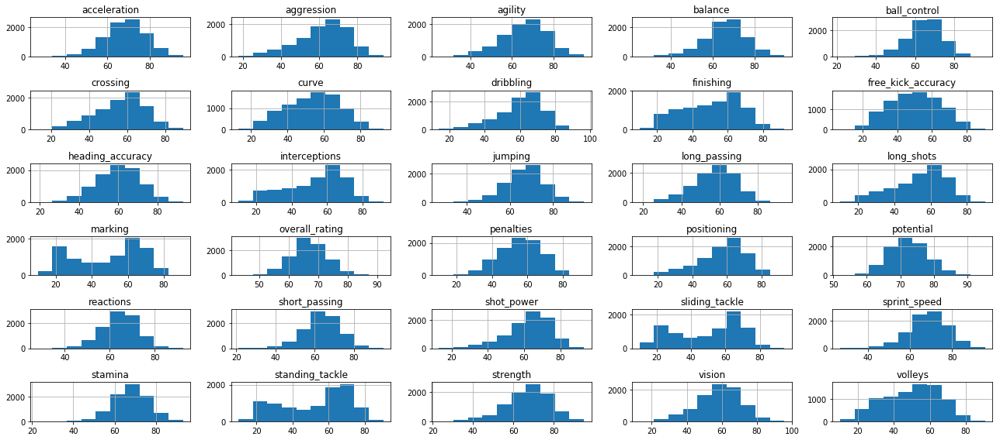

Looking at players by league:

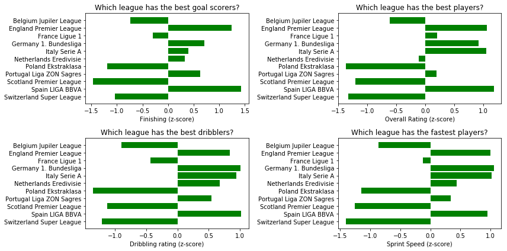

Looking at the best players by attribute:

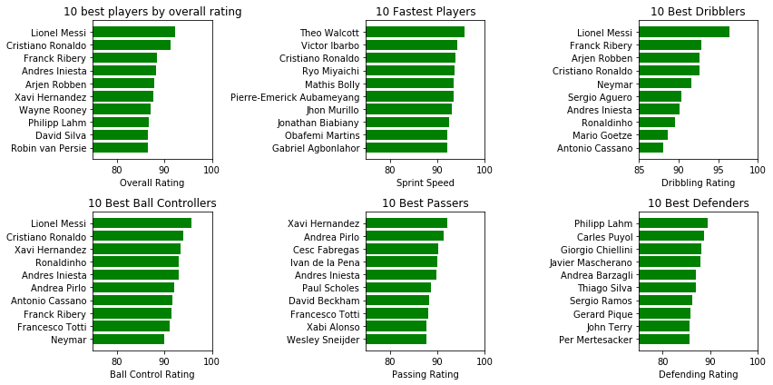

Before clustering, the dimensionality of the data was a concern. This dataset had a problem with multicolinearity as shown by high Variance Inflation Factors.

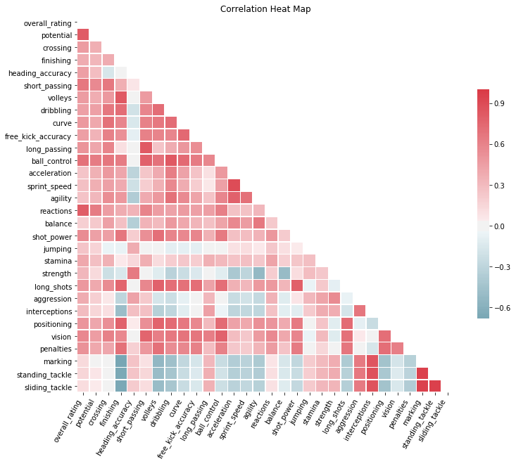

PCA was utilized before clustering with 11 principal components in accordance with the scree plot show below.

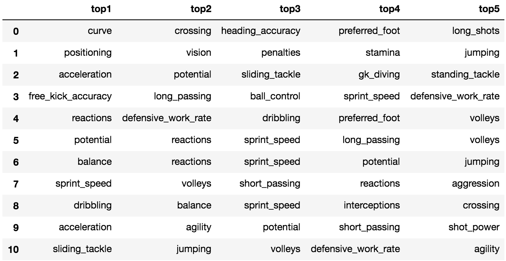

Visualizing the data in 2D after PCA:

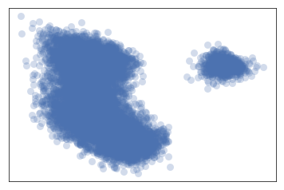

An example of a radar chart used to compare players is shown below with the players Mesut Ozil and Andres Iniesta.

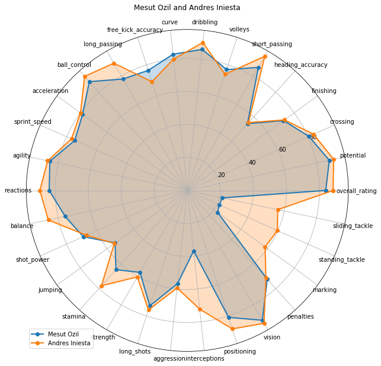

## Clustering:

The two main types of clustering used in this project were a hard clustering method in K-means, and a soft clustering method in Non Negative Matrix Factorization. The goal was to generate player clusters that could be used for player comparison.

## K-means:

The first attempt at clustering the data was made with K-means clustering. I attempted to cluster with a range of clusters from 2 to 12 and observed the resulting silhouette plots and cluster visualizations.

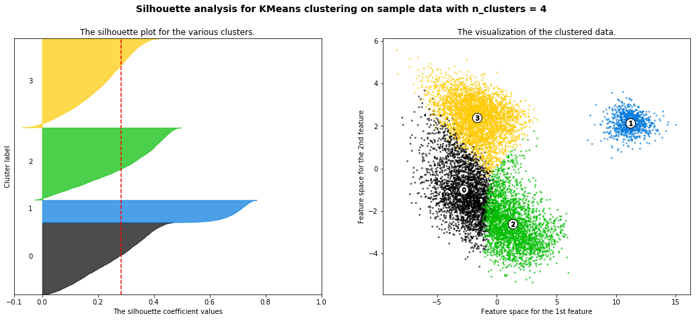

Average silhouette score: .283

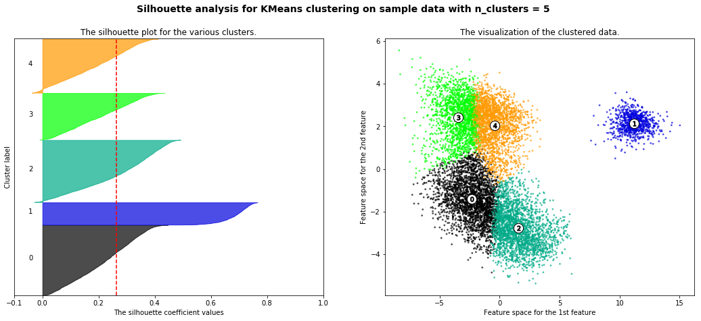

Average silhouette score : .263

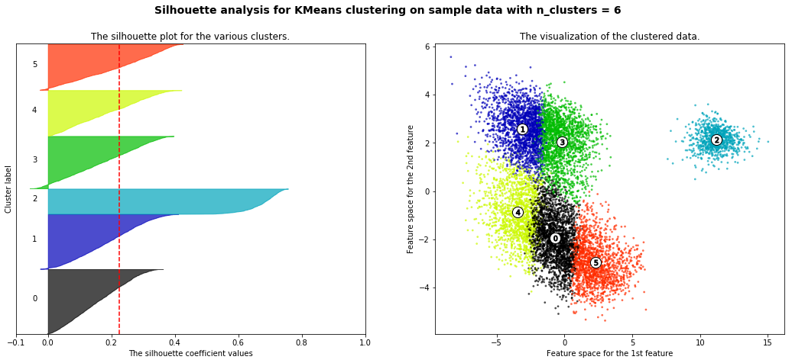

Average silhouette score: .225

Ultimately, 6 clusters seemed to be the optimal number of clusters to differentiate playstyles as much as possible. After 6 clusters, the clustering became extremely messy and non interpretable. After looking into the clusters, I labeled the clusters as following:
  - Cluster 1: Center Backs
  - Cluster 2: Forwards/Advanced Playmakers
  - Cluster 3: Goalkeepers
  - Cluster 4: Full Backs/Center Backs
  - Cluster 5: Box to Box Midfielders/Holding Midfielders
  - Cluster 6: Wingers/Wingbacks

## NMF:

Using NMF, the goal was to soft cluster players into latent topics or in this case playstyles. NMF was performed using 7 latent topics with the resulting latent topics shown below.

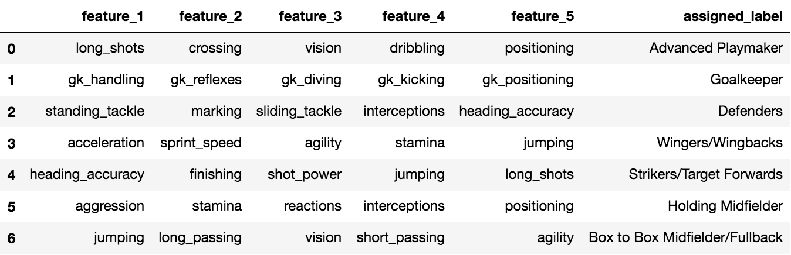

From these labels, individual players could be interpreted based on how highly they weight on a particular playstyle. 9 players were selected who I had strong intuition as to what playstyle they should weight most heavily on. These players are shown in the plot below.

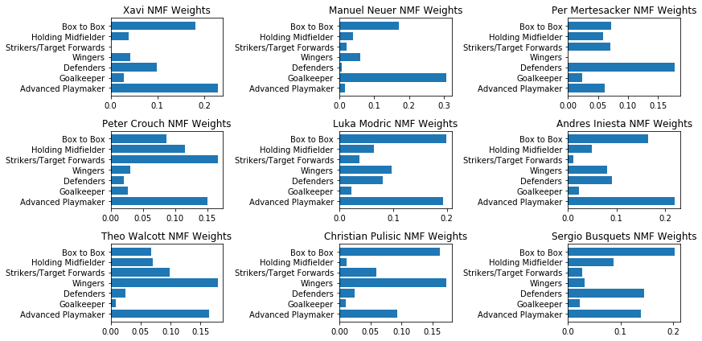

Ultimately, the soft clustering proved to be a bit more insightful into a particular players playstyle. Soccer players are unique in that the often exhibit characteristics and have attributes that could be translated to many different positions. This soft clustering gives a better insight into what combination of attributes and playstyles a player weights most on, rather than a hard cluster assignment as with k-means.

## Player Comparisons:

Player comparison was done using K Nearest Neighbors with a player and its five nearest neighbors in the same cluster. The player and their five nearest neighbors can be compared visually using radar charts. Some results of this are shown using the radar charts below for 5 selected players. 

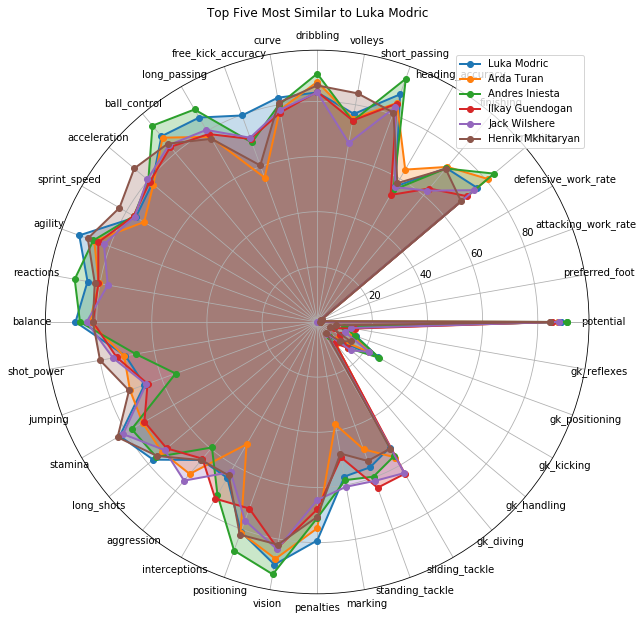

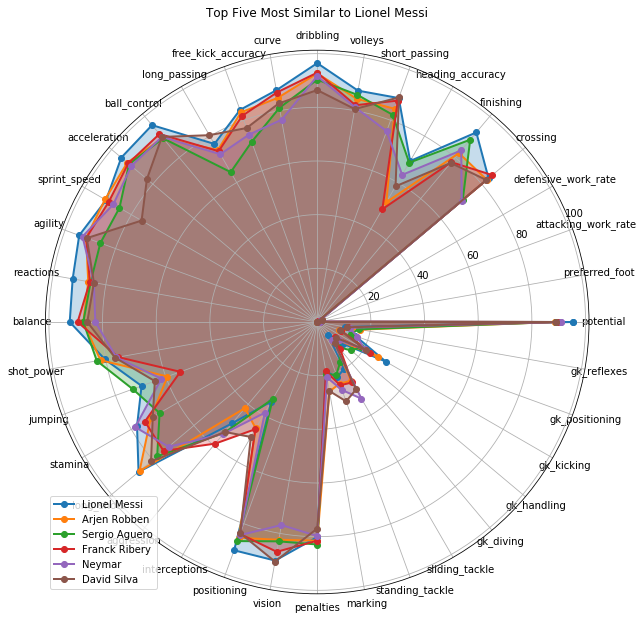

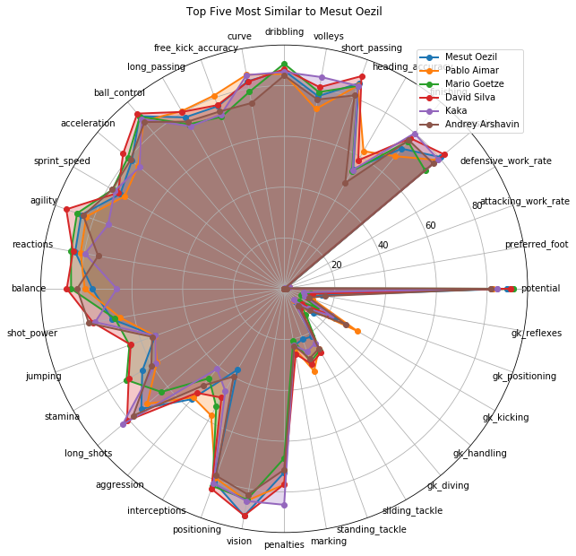

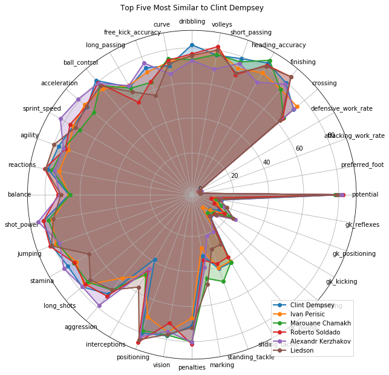

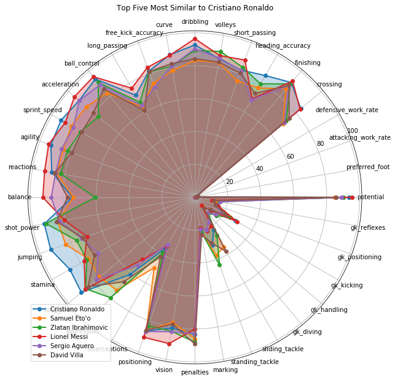

While the data seemed to be unfit for clustering in general, the player comparisons managed to be fairly interpretable. When analyzing the radar charts, the player comparisons made sense both intuitively and visually. The comparable players map together fairly well as shown by the radar charts. While the clustering did not do a fantastic job of clustering players by playstyle, the clusters do seem to still cluster very similar players based on their attributes. 

## Future Work:

- Obtain real player statistics.
- Gather more granular data (web scraping).
- Obtain transfer market data for each player.
- Compare players based on performance and. price
- Make historical comparisons between players.

## References:

-   https://www.kaggle.com/hugomathien/soccer/kernels
